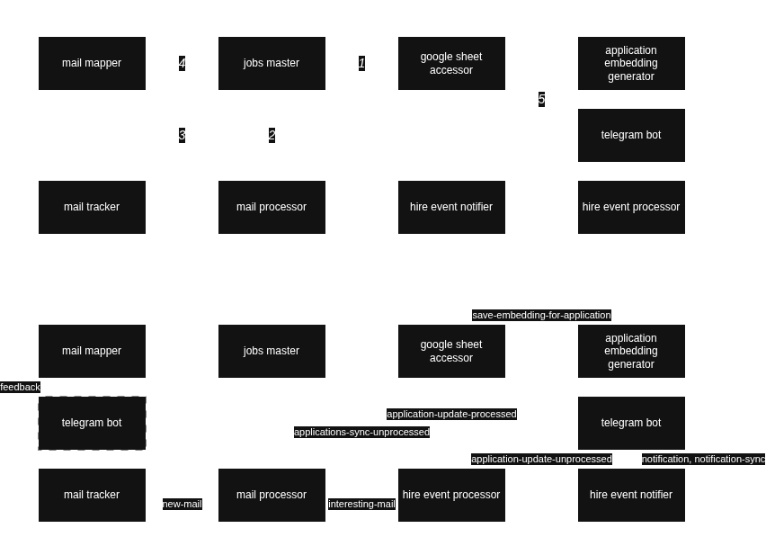

### How it works?

- `mail-tracker` polls Gmail via `GMAIL_USER` / `GMAIL_APP_PASSWORD`, deduplicates messages in Redis, and publishes normalized payloads with attachments/ICS to Kafka topic `new-mail`.
- `mail-processor` consumes `new-mail`, normalizes content, builds OpenAI embeddings, classifies emails into hiring-related labels, stores data in Postgres, and publishes mapped interesting emails to Kafka topic `interesting-mail`.
- `mail-mapper` matches interesting emails to tracked applications using scoring weights and calibrations from Postgres, records matches for analysis, and emits user feedback events to Kafka topic `feedback`.
- `google-sheets-accessor` keeps the Google Sheet of applications in sync, persists data to Postgres, and emits Kafka events for application updates plus embedding requests to `add-embedding-for-application`.
- `application-embedding-generator` consumes embedding requests, produces embeddings via OpenAI, and publishes them back to Kafka topic `save-embedding-for-application`.
- `hire-event-processor` merges interesting emails and sheet updates into canonical hire events on Kafka topics (`hire-event`, `applications-sync-*`, `application-update-*`).
- `hire-event-notifier` converts hire events into notification payloads on `notification` and `notification-sync` topics for downstream consumers.
- `telegram-bot` delivers notifications to Telegram users and forwards manual feedback to Kafka topic `feedback`.
- `jobs-master` schedules periodic application sync jobs so the pipeline stays up to date.
- Monitoring is available through Prometheus and Grafana, shipping with the `Mail Mapper Overview` dashboard.

### Infrastructure

### HTTP & Kafka interactions

HTTP calls:
1. jobs-master → google-sheets-accessor: fetch/cleanup/diff via `api/application/*`.
2. jobs-master → mail-processor: `POST /api/mails/interesting/submit`.
3. mail-processor → mail-mapper: `POST /api/mappings/resolve` (MailMapperClient).
4. mail-mapper → google-sheets-accessor: `POST /api/application/list` (applications without replies).
5. telegram-bot → google-sheets-accessor: `POST /api/application/update-internal` and `POST /api/application/update-external` (diff apply buttons).

Kafka pipelines:
1. mail-tracker → new-mail → mail-processor.
2. mail-processor → interesting-mail → hire-event-processor.
3. hire-event-processor → hire-event → hire-event-notifier.
4. hire-event-notifier → notification → telegram-bot.
5. hire-event-notifier → notification-sync → telegram-bot.
6. telegram-bot → application-update-unprocessed → hire-event-processor.
7. hire-event-processor → application-update-processed → google-sheets-accessor.
8. jobs-master → applications-sync-unprocessed → hire-event-processor.
9. hire-event-processor → applications-sync-processed → hire-event-notifier.
10. telegram-bot → feedback → mail-mapper.
11. google-sheets-accessor → add-embedding-for-application → application-embedding-generator.
12. application-embedding-generator → save-embedding-for-application → google-sheets-accessor.

### Last but not least

* Follow `CODESTYLE.md` and use `AGENTS.md` for your AI agent (`AGENTS_ADDITION.md` is in `.gitignore` so you can add custom instuctions in this file)
* Check [Mail Mapper Readme](mail-mapper/README.md) for deeper understanding of the service
